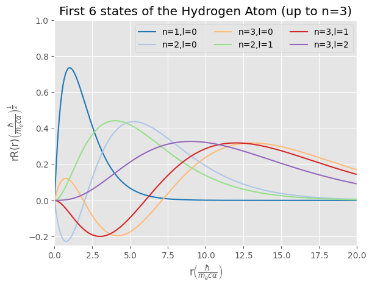

<style>
img[alt~="center"] {
  display: block;
  margin: 0 auto;
}
</style>


# **Hydrogen Atom**

**John Andrew Kypriotakis**

Advanced Computational Physics Course

---

# TI Schrödinger Equation (TISE)

$$ \left(\frac{\hbar^2}{2m_e}\nabla^2+\frac{e^2}{4\pi\epsilon_0r}+E\right)\ket{\Psi}=0 $$

a.u.:

$$ \left(\frac{1}{2}\nabla^2+\frac{1}{r}+E\right)\ket{\Psi}=0 $$

Separate Variables:

$$ \left(\frac{1}{2}\nabla^2+\frac{1}{r}+E\right)\ket{\Phi}\ket{\Theta}\ket{R}=0 $$

---

# Radial TISE (RTISE)

$$ \left(\frac{1}{2}\nabla^2+\frac{1}{r}+E\right)Y_{l,m_l}\frac{u(r)}{r}=0 $$

Finally:
$$\mathbf{\frac{d^2u}{dr^2}-\left(\frac{l\left(l+1\right)}{r^2}-\frac{2}{r}-E\right)u=0}$$

Bounds:
$$\mathbf{u(0)=0}, \mathbf{u(\infty)=0}$$

---

# First-Order Transformed RTISE

$$\mathbf{y=\begin{bmatrix}u \\ \frac{du}{dr}\end{bmatrix}}$$

$$\mathbf{\frac{dy}{dr}=\begin{bmatrix}\frac{du}{dr} \\ \frac{d^2u}{dr^2}\end{bmatrix}=\begin{bmatrix}\frac{du}{dr} \\ \left(\frac{l\left(l+1\right)}{r^2}-\frac{2}{r}-E\right)u\end{bmatrix}}$$

$$\mathbf{y(0)=\begin{bmatrix}0 \\ 0\end{bmatrix}}$$

---

# Shooting

If we have to satisfy: $u(a)=u(b)=0$, then:

1. choose $u(a)=0$ and $u'(a)=c(=0)$
2. using root finder, find the value of the parameter (energy) and corresponding $u(r)$ that satisfies $u(b)=0$
3. loop 1&2 until all states found

---

```python
class Hydrogen:
    '''
    Hydrogen atom class.
    We take in init:
        nmax: the maximum number of states (n) to go for
        ax: a matplotlib ax object to put the plots in if needed
    '''

    def __init__(self, nmax=15, ax=None):
        self.R = logspace(-6, 2.2, 500)  # the r axis
        self.nmax = nmax
        self.ax = ax
        self.bnd = []  # here we will store all found states
```

---

```python
# First Order Radial Time Independent Schroedinger Equation (System) for the Hydrogen Atom
def FO_RTISE(self, y, r, l, En):
    # return the derivative and the second derivative
    return array([y[1], (l * (l + 1) / r**2 - 2 / r - En) * y[0]])

# Solve the FO_RTISE
def Solve_RTISE(self, En, l):
    # invert the grid, integration from 0 to inf fails, from inf to 0 succeeds
    Rb = self.R[::-1]
    du0 = -1e-5  # u' initial condition for the solver
    # solve the system of equations
    urb = integrate.odeint(self.FO_RTISE, [0.0, du0], Rb, args=(l, En))
    # extract u from the array and invert to match the original grid
    ur = urb[:, 0][::-1]
    norm = sqrt(integrate.simps(ur**2, x=self.R))  # normalize the wavefunction
    ur *= 1.0 / norm
    return ur
```

---

```python
# Shooting algorithm residual u+u' at zero, if =0, then bound state found
def Shooting_Resid_0(self, En, l):
    ur = self.Solve_RTISE(En, l) / self.R**l  # get the solved wavefunction
    f0 = ur[0]
    f1 = ur[1]
    return f0 + (f1 - f0) * (0.0 - self.R[0]) / (
        self.R[1] - self.R[0]
    )  # return u(0)+u'(0)
```

---

```python
# Loop-find all bound states for a given l within nmax
def FindBound_l(self, l):
    Esearch = -1.2 / linspace(1, 20, 100) ** 2  # the energy range to look into
    n = l  # n starts from l (will later increase to starting at l+1)
    bnd = []
    # start with storing residual at E=Esearch[0]
    u0 = self.Shooting_Resid_0(Esearch[0], l)
    for i in range(1, len(Esearch)):
        # look into residual of next energy
        u1 = self.Shooting_Resid_0(Esearch[i], l)
```

---

```python
    if u0 * u1 < 0:
        # if the residual product is (-) => there is a bound state between them (Bolzano)
        # the energy of the bound state is the one that minimizes the resudual, between the 2 previous states
        Ebound = optimize.brentq(
            self.Shooting_Resid_0,
            Esearch[i - 1],
            Esearch[i],
            xtol=1e-16,
            args=(l),
        )
        n += 1
        bnd.append([n, l, Ebound])
        if len(bnd) > (self.nmax - l - 1):
            break  # if we have found all the expected states, stop looking
    u0 = u1  # old lower limit to look, becomes new
return bnd  # return the bound states found
```

---

```python
# Loop through all l between 0 and nmax-1 to find all bound states
def FindAllBound(self):
    # initialize self.bnd
    self.bnd = []
    for l in range(self.nmax):
        # add states found to the classes totals
        self.bnd.extend(self.FindBound_l(l))  
```

---

```python
# Plot a particular state
def PlotState(self, n, l, E):
    # if no ax object provided, we cannot plot in it
    if not self.ax:
        raise Exception(
            "To access this function you need to have initialized an ax in the class."
        )

    ur = self.Solve_RTISE(E, l)  # get the solution for provided n,l,E
    self.ax.plot(self.R, ur, "-", label=f"n={n:d},l={l:d}")
```

---

```python
# Plot all states in self.bnd
def PlotAllStates(self):
    for state in self.bnd:
        self.PlotState(state[0], state[1], state[2])

# Print all states
def PrintAllStates(self):
    sortedstates = sorted(self.bnd, key=lambda l: l[0], reverse=False)
    for state in sortedstates:
        print(f"n={int(state[0])}, l={int(state[1])}, E={float(state[2]):.4f}")
```

---

# Results - Plot of states



---

# Results - States

n=1, l=0, E=-1.0000
n=2, l=0, E=-0.2500
n=2, l=1, E=-0.2500
n=3, l=0, E=-0.1111
n=3, l=1, E=-0.1111
n=3, l=2, E=-0.1111
n=4, l=0, E=-0.0625
n=4, l=1, E=-0.0625
n=4, l=2, E=-0.0625
n=4, l=3, E=-0.0625