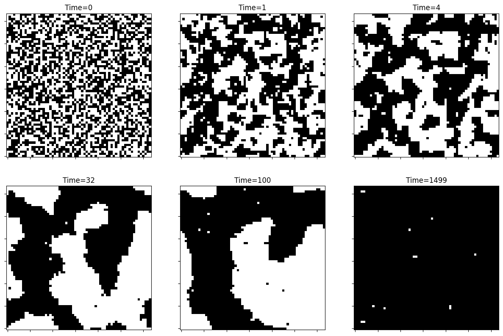
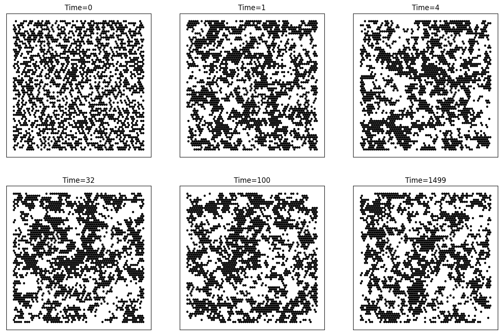
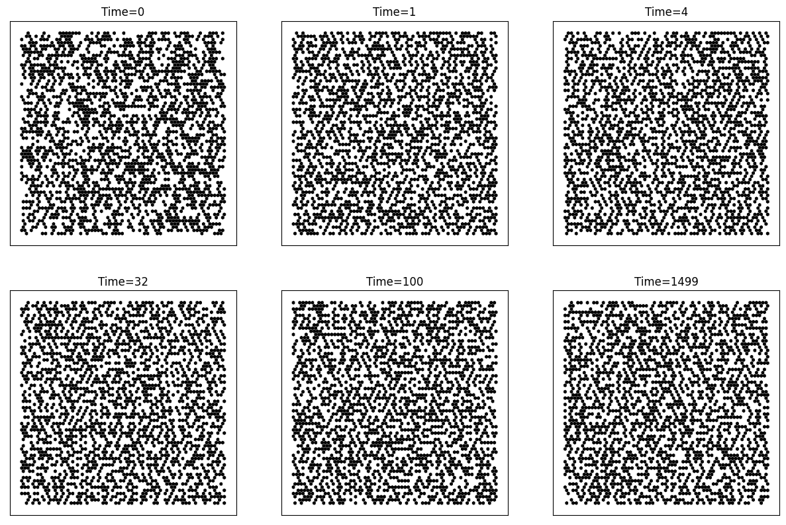
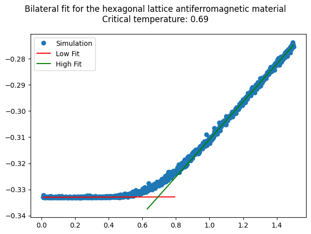

<style>
img[alt~="center"] {
  display: block;
  margin: 0 auto;
}
</style>

<style>
img[alt~="right"] {
  float: right;
}
</style>


# **2D Ising Model**

**John Andrew Kypriotakis**

Advanced Computational Physics Course

---

# Ising
## Principles
- Lattice
- Spin
- Interactions

---

# Lattice


---

# Spin


---

# Interactions

$$\mathbf{H=-J\sum_{i,j} \sigma_i \sigma_j}$$
Where i sums over the whole lattice and j over i's neighbors, however many they may be. σ is the spin of the atom. J is the exchange coupling constant.

$$\mathbf{Z=\sum_\sigma e^{-\beta H}}$$
Where σ represents the set of all possible spin configurations and $\beta\equiv\frac{1}{k_BT}$ is the inverse temperature.

---

# Nearest Neighbors

<style scoped>section { font-size: 30px; }</style>


### Orthogonal lattice
(x-1,y), (x+1,y), (x,y-1), (x,y+1)
<br/>
### Hexagonal lattice
###### If x even
(x-1,y), (x+1,y), (x,y-1), (x,y+1), (x-1,y-1), (x+1,y-1)
###### If x odd
(x-1,y), (x+1,y), (x,y-1), (x,y+1), (x+1,y+1), (x-1,y+1)


---

# Ferromagnetism

- Magnetic ordering phenomenon: alignment of spins in the same direction
- Net magnetization even in the absence of an external magnetic field
- Positive exchange coupling constant: $J>0$
- Phase transition with disappearance of spontaneous magnetisation at $T=T_C$

---

# Antiferromagnetism

- Magnetic ordering phenomenon: alignment of neighboring spins in opposite directions: antiferromagnetic ordering
- Net magnetization 0 
- Negative exchange coupling constant: $J<0$
- Phase transition with disappearance of antiferromagnetic ordering at $T=T_N$

---

# Metropolis algorithm

<style scoped>section { font-size: 30px; }</style>

1. Start with an initial configuration of the system.
2. Choose a spin or a group of spins to update.
3. Propose a trial move, which flips the selected spin(s) to a new configuration.
4. Calculate the change in energy, $\Delta E$, between the current configuration and the proposed configuration.
5. If $\Delta E \le0$, accept the move and update the configuration.
6. If $\Delta E>0$, generate a random number, r, between 0 and 1.
a. If $r\le e^{-\frac{\Delta E}{k_BT}}$, accept the move and update the configuration.
b. If $r\le e^{-\frac{\Delta E}{k_BT}}$, reject the move and keep the current configuration.
9. Repeat steps 2-6 for a sufficient number of iterations or until reaching equilibrium.

---

```python
class Ising:
    """
    Ising Model class.
    We take in init:
        temperature: the temperature of the crystal in our own units
        lattice: the lattice size (always a square shape)
        iterations: the iterations the user wants to run in modeling
        mesh: the lattice shape (ortho/hex)
        prop: the phenomenon of the lattice (ferro/antiferro)
        plots: whether the user wants plots (True), no plots (False) or animation (animate)
    """
    def __init__(
        self, temperature, lattice, iterations, mesh="ortho", prop="ferro", plots=True
    ):
        self.temperature = temperature
        self.lattice = lattice
        self.iterations = iterations
        # Initialize crystal with random up/down (1/-1) spins
        self.crystal = 2 * randint(2, size=(self.lattice, self.lattice)) - 1
        ...
```

---

```python
# Simulate the crystal
def simulate(self):
    E = 0  # Initialize energy
    M = 0  # Initialize magnetization

    # If plots, add initial state to plot, if animation, save initial frame
    ...

    # Loop Metropolis iteration times
    for i in range(self.iterations):
        # do one step to the crystal
        self.mcStep()

        # If plots, add plot at times 1,4,32,100,iterations end, if animation, save frame at every iteration
        ...

        E += self.E()  # add energy to total
        M += self.M()  # add magnetization to total

    # show the plots if done
    ...

    # return the energy and magnetization for set temperature, after all iterations
    return [E, M]
```

---

```python
# Metropolis MCMC step
def mcStep(self):
    beta = 1.0 / self.temperature  # beta parameter, units k_B=J=1
    lattice = self.lattice  # I'm lazy
    for i in range(lattice):
        for j in range(lattice):
            a = randint(0, lattice)  # random x-coordinate in the lattice
            b = randint(0, lattice)  # random y-coordinate in the lattice
            s = self.crystal[a, b]  # value of the crystal at xy
            nb = 0  # initialize the sum of the values of neighbors
            # add the value of each neighbor to the sum, depending on the mesh shape
            if self.mesh == "ortho" or self.mesh == "hex":
                nb += (
                    self.crystal[(a + 1) % lattice, b]
                    + self.crystal[a, (b + 1) % lattice]
                    + self.crystal[(a - 1) % lattice, b]
                    + self.crystal[a, (b - 1) % lattice]
                )
            if self.mesh == "hex" and (self.IsEven(a + 1)):
                nb += (
                    self.crystal[(a - 1) % lattice, (b - 1) % lattice]
                    + self.crystal[(a + 1) % lattice, (b - 1) % lattice]
                )
            elif self.mesh == "hex":
                nb += (
                    self.crystal[(a + 1) % lattice, (b + 1) % lattice]
                    + self.crystal[(a - 1) % lattice, (b + 1) % lattice]
                )

```

---

```python
            # compute the cost metric (energy gain/loss if spin at xy is swapped)
            if self.prop == "ferro":
                metric = 2 * s * nb
            elif self.prop == "antiferro":
                metric = -2 * s * nb

            # if the cost is negative, make the swap
            if metric < 0:
                s *= -1
            # if the cost isnt negative, make the swap only if thermal beats hamilton
            elif rand() < exp(-metric * beta):
                s *= -1
            # assign change
            self.crystal[a, b] = s
```

---

```python
# Energy of a given crystal state
def E(self):
    lattice = self.lattice  # I'm lazy
    energy = 0  # initialize energy
    # loop into all crystal positions
    for i in range(len(self.crystal)):
        for j in range(len(self.crystal)):
            S = self.crystal[i, j]  # valye at xy
            nb = 0  # initialize the sum of the values of neighbors
            # add the value of each neighbor to the sum, depending on the mesh shape
            if self.mesh == "ortho" or self.mesh == "hex":
                nb += (
                    self.crystal[(i + 1) % lattice, j]
                    + self.crystal[i, (j + 1) % lattice]
                    + self.crystal[(i - 1) % lattice, j]
                    + self.crystal[i, (j - 1) % lattice]
                )
            if self.mesh == "hex" and (self.IsEven(i + 1)):
                nb += (
                    self.crystal[(i - 1) % lattice, (j - 1) % lattice]
                    + self.crystal[(i + 1) % lattice, (j - 1) % lattice]
                )
            elif self.mesh == "hex":
                nb += (
                    self.crystal[(i + 1) % lattice, (j + 1) % lattice]
                    + self.crystal[(i - 1) % lattice, (j + 1) % lattice]
                )

            # add the appropriate value to the running sum
            if self.prop == "ferro":
                energy += -nb * S
            elif self.prop == "antiferro":
                energy += nb * S

    # divide by the degrees of freedom to acquire a comparable value
    if self.mesh == "hex":
        return energy / 6.0
    elif self.mesh == "ortho":
        return energy / 4.0
```

---

```python
# Magnetization of a given crystal state
def M(self):
    mag = sum(self.crystal)
    return mag
```

---

# Results - Ferromagnetic Orthogonal


---

### Results - Ferromagnetic Orthogonal - Below $T_C$



---

### Results - Ferromagnetic Orthogonal - Above $T_C$


---

## Results - Antiferromagnetic Orthogonal


---

### Results - Antiferromagnetic Orthogonal - Below $T_N$


---

### Results - Antiferromagnetic Orthogonal - Above $T_N$


---

# Results - Ferromagnetic Hexagonal


---

### Results - Ferromagnetic Hexagonal - Below $T_C$


---

### Results - Ferromagnetic Hexagonal - Above $T_C$



---

## Results - Antiferromagnetic Hexagonal


---

### Results - Antiferromagnetic Hexagonal - Below $T_N$?


---

### Results - Antiferromagnetic Hexagonal - Above $T_N$?



---

# What's wrong with hexagonal antiferromagnetism?

- No way to tile the space in black and white hexagons with only alternating black and white colors between edges.
- No way for hexagonal lattice to show antiferromagnetism.
- We see fractal pattern.
- We see phase transition.

---

#### Results - Phase transition in hexagonal antiferromagnetism



---


